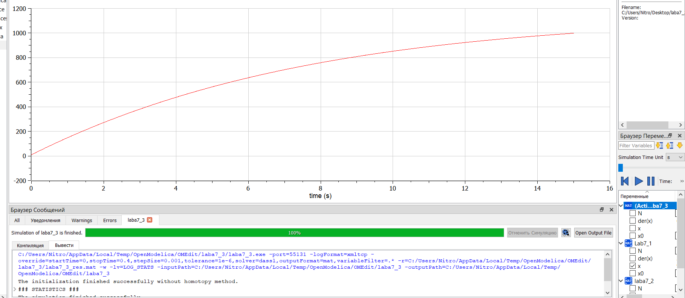

<h1 align="center">

РОССИЙСКИЙ УНИВЕРСИТЕТ ДРУЖБЫ НАРОДОВ 

Факультет физико-математических и естественных наук  

Кафедра прикладной информатики и теории вероятностей

ПРЕЗЕНТАЦИЯ ПО ЛАБОРАТОРНОЙ РАБОТЕ №7
  
<h2 align="right">

дисциплина: Математическое моделирование

Преподователь: Кулябов Дмитрий Сергеевич

Студент: Никитин Александр Владимирович

Группа: НФИбд-03-19
  
  
<h1 align="center">

МОСКВА

2022 г.
</h1>

# **Прагматика выполнения лабораторной работы**

- знакомство с моделью эффективности рекламы
- работа с OpenModelica

# **Цель работы**

Построение модели эффективности рекламы

# Задачи выполнения лабораторной работы

Для уравнений эффективности рекламы:

Постройте графики распространения рекламы.
При этом объем аудитории N = 901, в начальный момент о товаре знает 9 человек. Для случая 2 определите в какой момент времени скорость распространения рекламы будет
иметь максимальное значение.

# **Выполнение лабораторной работы**

**_Построение модели эффективности рекламы_**

Уравнения для модели варианта-37:

Чтобы построить график распространения информации о товаре с учетом платной рекламы и с учетом сарафанного радио для первого уравнения, я написал следующий код:

и получил график:

Чтобы построить график распространения информации о товаре с учетом платной рекламы и с учетом сарафанного радио для второго уравнения, я написал следующий код:

и получил график:

Чтобы построить график распространения информации о товаре с учетом платной рекламы и с учетом сарафанного радио для третьего уравнения, я написал следующий код:

и получил график:

# Выводы

После завершения данной лабораторной работы - я научился выполнять построение модели распространения информации о товаре с учетом платной рекламы и с учетом сарафанного радио в OpenModelica.
